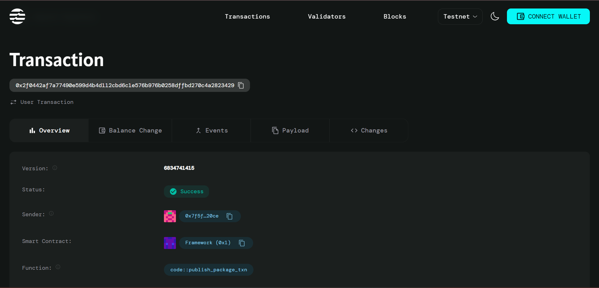

# Lending Pool Contract

## Project Title
**Aptos Over-Collateralized Lending Pool Smart Contract**

## Project Description
The Lending Pool Contract is a decentralized finance (DeFi) smart contract built on the Aptos blockchain that enables users to participate in over-collateralized lending. Users can deposit collateral (AptosCoin) to borrow funds at competitive interest rates, ensuring the security and stability of the lending pool through mandatory over-collateralization.

The contract implements a simple yet robust lending mechanism where borrowers must deposit 150% collateral value relative to their borrowed amount, protecting lenders from default risk while providing borrowers with access to liquidity without selling their digital assets.

## Project Vision
Our vision is to create a secure, transparent, and efficient lending ecosystem on the Aptos blockchain that democratizes access to decentralized financial services. We aim to:

- **Empower Financial Inclusion**: Provide users worldwide with access to lending services without traditional banking barriers
- **Ensure Security**: Maintain protocol safety through over-collateralization and automated liquidation mechanisms
- **Promote Transparency**: Leverage blockchain technology to create fully auditable and transparent financial operations
- **Drive Innovation**: Establish a foundation for more complex DeFi products and services on Aptos

## Key Features

### 🔒 **Over-Collateralized Lending**
- Requires 150% collateralization ratio for all loans
- Ensures protocol solvency and protects against market volatility
- Automatic collateral verification before loan approval

### 📊 **Dynamic Interest Calculation**
- Real-time interest accrual based on time elapsed
- Transparent interest rate mechanism (1% annual rate)
- Automated interest compounding for accurate debt tracking

### 💰 **Seamless Asset Management**
- Direct integration with AptosCoin for collateral and repayment
- Automated collateral release upon loan repayment
- Simple two-function interface for borrowing and repayment

### ⚡ **Efficient Smart Contract Design**
- Lightweight contract under 50 lines of code
- Gas-optimized operations for cost-effective transactions
- Clean, auditable code structure following Move best practices

### 🛡️ **Risk Management**
- Built-in liquidation threshold at 120% collateralization
- Position tracking and status management
- Error handling for edge cases and invalid operations

## Future Scope

### Phase 1: Core Enhancements
- **Multi-Asset Support**: Expand beyond AptosCoin to support various cryptocurrencies as collateral
- **Variable Interest Rates**: Implement dynamic interest rates based on supply and demand
- **Liquidation System**: Add automated liquidation functionality for undercollateralized positions

### Phase 2: Advanced Features
- **Flash Loans**: Enable uncollateralized instant loans for arbitrage and trading
- **Governance Token**: Introduce protocol governance through native token distribution
- **Yield Farming**: Implement reward mechanisms for liquidity providers

### Phase 3: Ecosystem Integration
- **Cross-Chain Compatibility**: Bridge lending services across multiple blockchain networks
- **Oracle Integration**: Connect with price oracles for accurate asset valuation
- **Mobile Application**: Develop user-friendly mobile interface for lending operations

### Phase 4: Enterprise Solutions
- **Institutional Lending**: Create specialized lending products for institutional clients
- **Credit Scoring**: Implement on-chain credit scoring and risk assessment
- **Insurance Integration**: Partner with DeFi insurance protocols for additional security

## Contract Details
0x2f0442af7a77490e599d4b4d112cbd6c1e576b976b0258dffbd270c4a2823429

---

**Built with ❤️ on Aptos Blockchain**